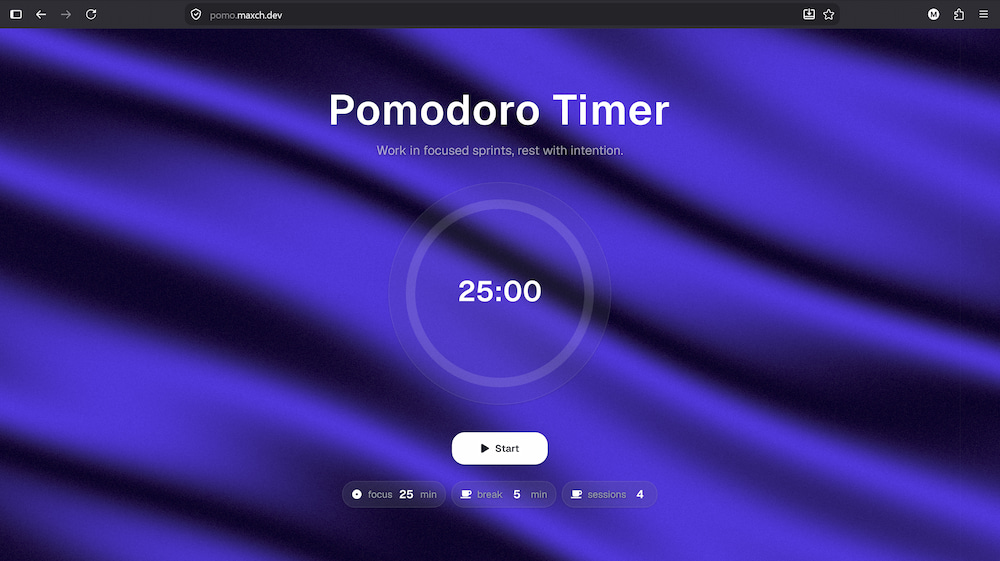

# Pomodoro Timer

A Pomodoro-technique timer built with Next.js, featuring configurable focus/break sessions, sound cues, an animated 3D silk background, and a circular progress clock.

**Live at [pomo.maxch.dev](https://pomo.maxch.dev)**

## Features

- Configurable focus time, break time, and session count
- Start / pause / reset / skip controls
- Audio cues for session start, break start, and timer completion
- Dynamic browser tab title showing the live countdown
- Animated background from ReactBits rendered with `three.js` / `@react-three/fiber`
- Circular progress clock via `react-circular-progressbar`
- UI built with Tailwind CSS and shadcn-style components

## Project Structure

- [app/page.tsx](app/page.tsx) — main entry page
- [components/PomoTimer/](components/PomoTimer/) — timer UI (clock, controls, settings, success dialog)
- [components/bg/Silk.tsx](components/bg/Silk.tsx) — animated 3D background
- [hooks/useTimer.tsx](hooks/useTimer.tsx) — timer state machine (sessions, breaks, countdown)
- [hooks/useSettings.tsx](hooks/useSettings.tsx) — user-configurable settings (focus/break minutes, session count)

## Tech Stack

Next.js 16, React 19, TypeScript, Tailwind CSS, Reactbits.dev, react-icons
